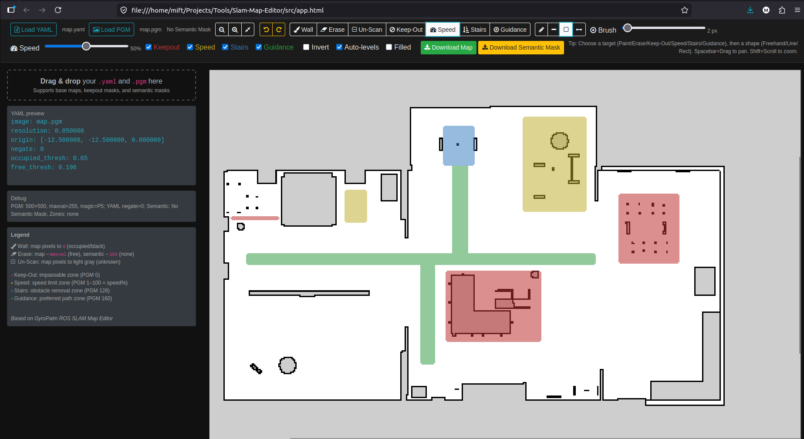

<div align="center">

# SLAM Map Editor

**A web-based editor for SLAM maps with semantic Nav2 filter support.**

[](LICENSE) [](https://docs.ros.org/en/rolling/) [](https://navigation.ros.org/)



</div>

---

## ✨ Features

### Map Editing
| Tool | Description |
|---|---|
| **Wall** | Paint occupied cells (black/walls) |
| **Erase** | Erase walls and filter zones |
| **Un-Scan** | Mark area as unknown |
| **Line / Rectangle** | Clean straight edges and filled shapes |
| **Measure** | Measure distance between two points |

- Adjustable brush size slider
- Drag & drop PGM + YAML files to load
- Undo / Redo (`Ctrl+Z` / `Ctrl+Y`)

### Semantic Filter Zones
| Zone | Color | What It Does |
|---|---|---|
| **Keepout** | 🔴 | Marks impassable zones |
| **Speed** | 🟡 | Sets speed limit (1–100%) |
| **Passable** | 🔵 | Removes obstacle cost in marked area |
| **Guidance** | 🟢 | Marks preferred navigation paths |

### Controls
| Input | Action |
|---|---|
| `Left click` | Draw with selected tool |
| `Middle click` + drag | Pan the map |
| `Right click` | Disabled (no context menu) |
| `Spacebar` + drag | Pan the map |
| `Shift` + scroll | Zoom to cursor |
| `Ctrl+Z` / `Ctrl+Y` | Undo / Redo |

---

## 🚀 Getting Started

### Run Locally

Clone the repo and open `src/app.html` with your browser, no server or build step needed.

```bash
git clone https://github.com/MiftahulSN/slam-map-editor.git
```

### GitHub Pages

Try the hosted version directly

👉 [https://miftahulsn.github.io/slam-map-editor/src/app.html](https://miftahulsn.github.io/slam-map-editor/src/app.html)

### Known Issue

> ⚠️ **PGM may need to be loaded twice.** If the map does not appear after loading the PGM file, try loading it again. This is a known bug.

---

## 📖 Usage

Demo maps are included in the `assets/maps` folder.

1. **Load your map** : drag & drop `map.yaml` and `map.pgm` into the drop zone.
2. **Pick a tool** : Wall, Erase, Un-Scan, Keep-Out, Speed, Passable, or Guidance.
3. **Draw** : use freehand, line, or rectangle mode. Adjust brush size with the slider.
4. **Speed tool** : set the percentage (1–100%) with the slider before drawing.
5. **Export** : click `Download Map` or `Download Semantic Mask` when done.

---

## 📦 Output

The app provides **three** download options:

### `Download Map` 🗺️
Exports the **edited base map** as `map_edited.pgm` + `map_edited.yaml`

- Your occupancy grid with wall/erase/unscan edits
- No filter zone data included
- Used by Nav2's `map_server`

### `Download Semantic Mask` 🎨
Exports all filter zones combined as `semantic_mask.pgm` + `semantic_mask.yaml`

- All filter zones (keepout, speed, passable, guidance) in one PGM file
- Pixel values encode zone types (see encoding table below)
- Requires a custom Nav2 plugin to parse the combined values

### `Download Individual Filter Masks` 📋
Click the dropdown arrow next to **Download Semantic Mask** to export each filter as a separate PGM + YAML:

| Download | Files | Nav2 Plugin |
|---|---|---|
| Keepout Only | `keepout_mask.pgm` + `keepout_mask.yaml` | `keepout_filter` (built-in) |
| Speed Only | `speed_mask.pgm` + `speed_mask.yaml` | `speed_filter` (built-in) |
| Passable Only | `passable_mask.pgm` + `passable_mask.yaml` | `passable_filter` (custom) |
| Guidance Only | `guidance_mask.pgm` + `guidance_mask.yaml` | `guidance_filter` (custom) |

Each individual mask contains **only its zone type** — all other pixels are set to the "free" value for that filter. This allows direct use with Nav2's built-in keepout and speed filters without any custom code.

---

## 🧩 Nav2 Configuration

### Keepout Mask

The `keepout_mask.pgm` uses standard occupancy encoding compatible with Nav2's built-in `keepout_filter`:

| PGM Pixel | Meaning |
|:---:|---|
| `0` | Keepout zone (blocked) |
| `254` | Free (passable) |

The exported `keepout_mask.yaml` uses default map settings (`mode: trinary`). No special configuration is needed — point the filter to the mask and it works.

<details>
<summary>📋 Nav2 parameter example</summary>

```yaml
# costmap_filter_info_publisher for keepout
costmap_filter_info_publisher:
  ros__parameters:
    type: 0  # KEEPOUT
    filter_info_topic: "keepout_costmap_filter_info"
    mask_topic: "/keepout_filter_mask"
    base: 0.0
    multiplier: 1.0

# keepout filter plugin (add to costmap plugins list)
keepout_filter:
  plugin: "nav2_costmap_2d::KeepoutFilter"
  enabled: True
  filter_info_topic: "keepout_costmap_filter_info"
```

</details>

### Speed Mask

The `speed_mask.pgm` uses greyscale encoding where **darker = more speed restriction**:

| PGM Pixel | Speed Limit | Example |
|:---:|---|---|
| `255` (white) | No restriction (free) | — |
| `191` (light grey) | 25% max speed | `191 → OG ~25 → 25×(-1)+100 = 75%` speed limit |
| `128` (mid grey) | 50% max speed | `128 → OG ~50 → 50×(-1)+100 = 50%` speed limit |
| `0` (black) | Fully stopped | `0 → OG 100 → 100×(-1)+100 = 0%` speed limit |

The exported `speed_mask.yaml` automatically sets:
```yaml
mode: scale          # Required! Default "trinary" will break greyscale values
occupied_thresh: 1.0 # No thresholding — full range conversion
free_thresh: 0.0     # No thresholding — full range conversion
```

In your Nav2 config, set `base: 100.0` and `multiplier: -1.0` for the CostmapFilterInfo publisher. This reverses the OccupancyGrid values so darker pixels produce lower speed limits.

<details>
<summary>📋 Nav2 parameter example</summary>

```yaml
# costmap_filter_info_publisher for speed
costmap_filter_info_publisher:
  ros__parameters:
    type: 1  # SPEED
    filter_info_topic: "speed_costmap_filter_info"
    mask_topic: "/speed_filter_mask"
    base: 100.0
    multiplier: -1.0

# speed filter plugin (add to costmap plugins list)
speed_filter:
  plugin: "nav2_costmap_2d::SpeedFilter"
  enabled: True
  filter_info_topic: "speed_costmap_filter_info"
  speed_limit_topic: "speed_limit"

# controller server must subscribe to speed_limit
controller_server:
  ros__parameters:
    speed_limit_topic: "speed_limit"
```

</details>

> 💡 **Ready-to-use Nav2 parameter files** are available at [MiftahulSN/nav2-filters](https://github.com/MiftahulSN/nav2-filters) — see `params_keepout.yaml` and `params_speed.yaml`.

### Passable Mask

The `passable_mask.pgm` uses inverted encoding so Nav2's map_server produces OccupancyGrid `0` on passable zones (the filter clears cost where OG `== 0`):

| PGM Pixel | Meaning |
|:---:|---|
| `254` (white) | Passable zone — filter clears obstacle cost |
| `0` (black) | Free (no action) |

The exported `passable_mask.yaml` uses default `mode: trinary`. No special configuration is needed.

Requires the custom `passable_filter` plugin from [MiftahulSN/nav2-filters](https://github.com/MiftahulSN/nav2-filters).

### Guidance Mask

The `guidance_mask.pgm` uses the same inverted encoding as passable:

| PGM Pixel | Meaning |
|:---:|---|
| `254` (white) | Guidance zone — planner prefers this path |
| `0` (black) | Free (may become buffer zone) |

The `guidance_filter` plugin raises the cost of cells **surrounding** guidance zones (within a configurable `buffer_radius`), creating a "cost valley" that makes the planner prefer guidance paths without blocking alternatives.

The exported `guidance_mask.yaml` uses default `mode: trinary`. No special configuration is needed.

| Parameter | Default | Description |
|---|---|---|
| `buffer_radius` | `5` cells (~0.25m) | BFS expansion around guidance zones |
| `surround_cost` | `5` | Cost applied to buffer zone cells |

**Global costmap only** — the local costmap is left untouched so the controller can react to dynamic obstacles freely.

Requires the custom `guidance_filter` plugin from [MiftahulSN/nav2-filters](https://github.com/MiftahulSN/nav2-filters).

---

## 🔌 Nav2 Filter Compatibility

| Filter | Type | Status |
|:---|:---|:---|
| 🚫 Keepout | Nav2 **built-in** | Works with `keepout_filter` out of the box |
| ⏱️ Speed | Nav2 **built-in** | Works with `speed_filter` out of the box |
| 🪜 Passable | **Custom** plugin | Requires [nav2-filters](https://github.com/MiftahulSN/nav2-filters) (`passable_filter`) |
| 🧭 Guidance | **Custom** plugin | Requires [nav2-filters](https://github.com/MiftahulSN/nav2-filters) |

> _For the custom **Passable** and **Guidance** costmap filter plugins_
👉 **[MiftahulSN/nav2-filters](https://github.com/MiftahulSN/nav2-filters)**

---

## 📊 Semantic PGM Encoding

The semantic mask is a single PGM file where pixel values represent zone types:

| PGM Value | Zone | Editor Color | Nav2 Behavior |
|:---:|---|:---:|---|
| `0` | Keepout | 🔴 | Lethal cost — impassable |
| `1`–`100` | Speed | 🟡 | Speed limit at that percentage |
| `128` | Passable | 🔵 | Clears obstacle cost — makes area passable |
| `160` | Guidance | 🟢 | Raises surrounding cost — preferred path |
| `255` | Free | transparent | No action |

> _Values `101-127`, `129-159`, and `161-254` are reserved for future filters._

---

## 🙏 Acknowledgements

This project is a fork of [ROS SLAM Map Editor](https://github.com/GyroPalm/ROS-SLAM-Map-Editor) by [Dominick Lee](https://dominicklee.com). If you use this tool in your work or research, please cite the original work.

> Lee, Dominick. (2025). ROS SLAM Map Editor [Computer software]. GyroPalm, LLC. https://github.com/GyroPalm/ROS-SLAM-Map-Editor

Upgraded by [MiftahulSN](https://github.com/MiftahulSN). This project remains open-source under the MIT License, see [LICENSE](LICENSE) for details.
